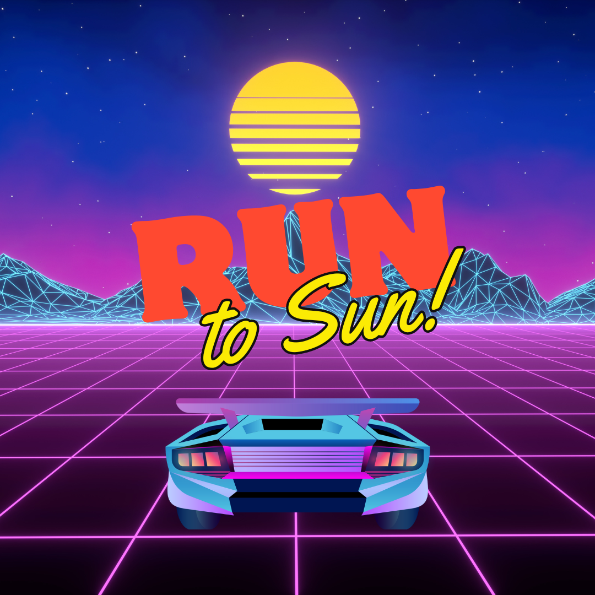

# Run to Sun

Este é um jogo de teste onde um carro percorre um ambiente inspirado no estilo retrowave, utilizando técnicas de jogos antigos como Outrun. A estrada se movimenta dinamicamente enquanto os demais elementos permanecem estáticos, criando uma atmosfera nostálgica.

## Tecnologias Utilizadas
- **Three.js**: Biblioteca JavaScript para renderização 3D.
- **GLSL**: Linguagem de shading utilizada para criar efeitos visuais.
- **JavaScript**: Programação para interatividade e lógica do jogo.
- **HTML/CSS**: Estrutura e estilização da página web.

## Funcionalidades
- **Movimento da Estrada**: A estrada se move para simular o movimento enquanto o carro permanece no centro da tela.
- **Palmeiras Animadas**: As palmeiras balançam com a cena, adicionando realismo ao ambiente.
- **Obstáculos**: Obstáculos são gerados periodicamente, exigindo que o usuário desvie com as setas do teclado (esquerda e direita) / Desativada a opção de gameover.
- **Pontuação**: Pontuação é incrementada a cada segundo enquanto o jogo está ativo.
- **Música**: Reprodução de música aleatória ao iniciar o jogo.

